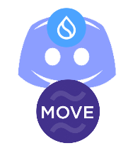
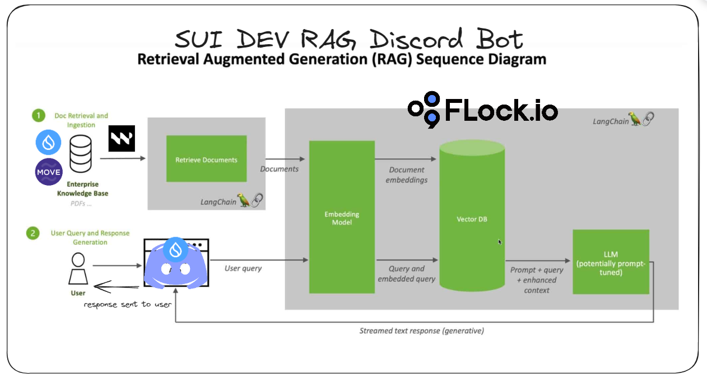

**SUI-RAG-Dev-Discord-bot**
=====================

**Introduction**
---------------

The Sui Dev AI Discord Bot is a revolutionary project that combines the power of AI and Retrieval Augmented Generation to create a seamless and efficient developer friendly experience for developers building on SUI. This bot is designed to assist developers in their workflow, providing fixes to their common problems , real-time updates to the new packages published and insights to help them stay on top of their projects.

**Features**
------------

### **Real-Time Updates**

The Sui Dev AI Bot provides real-time updates on project progress, allowing developers to stay informed and focused on their tasks.

### **Intelligent Insights**

The bot uses AI-powered insights to analyze project data and provide valuable recommendations to developers, helping them optimize their workflow and improve productivity.

### **Discord Integration with Customizable Notifications**

The bot is fully integrated with Discord, allowing developers to access its features and functionality directly within their Discord channels.

Developers can customize their notifications to receive updates on specific project milestones, ensuring they stay informed without being overwhelmed by unnecessary information.

### **Flock.io Integration >>> Whole SUI Dev community participation Guranteed**

The bot is built on top of Flock.io, which decentralises training and value alignment. 
Ensuring that AI objectives match the public’s ethics and societal aims, that decision-making falls to communities, and that usefulness is a top priority.

## What is Retrieval Augmented Generation
RAG enhances the existing potent functionalities of LLMs for particular domains or an organization's internal knowledge repository, 
without necessitating model retraining. This method offers a cost-efficient means of enhancing LLM output, ensuring its continued relevance, precision, 
and utility across diverse settings.  

LLMs are used to generate AI powered intelligent chatbots, computer vision, robotics and consumer devices, etc.
Unfortunately, the nature of LLM technology introduces unpredictability in LLM responses as its not a state machine and it undergoes the following challenges:
1. Hallucination - the phenomena where the LLM responds with false information or partially false information which is problem hard to resolve.
2. Presenting out-of-date or generic information when the user expects a specific, current response.
3. Generating responses from non-authoritative sources and finetuning or training an LLM for a domain specific conversation incurs additional costs.

RAG brings in the following benefits over an LLM:
1. With the help of RAG, LLMs can provide latest information to users by feeding in latest research, statistics, or news/social media feeds to the generative models. This can be 
2. RAG is a cost efficient option and makes an LLM broadly accessible and usable.
3. Both developers and users can not trust LLMs to present accurate information with source attribution increasing trust and confidence in generative AI solution.

**How to Use**
--------------

### **Getting Started**

To use the Sui Dev AI Bot, simply invite it to your Discord server and configure it to your project's Flock.io workspace.

### **Customizing Your Experience**

Customize your notifications and insights to fit your workflow and preferences.

### **Getting the Most Out of the Bot**

Use the bot's features to streamline your workflow, stay informed, and optimize your productivity.

**Technical Details**
-------------------

### **Programming Languages**

The bot is built using Python and utilizes the Discord.py library for its Discord integration.

### **Flock.io API**

The bot utilizes the Flock.io API to integrate with Flock.io and access project data.

### **AI Model**

The bot's AI model is trained on a dataset of project management best practices and is continuously updated to improve its insights and recommendations.

## Working of a Retrieval Augmented Generation
Shown below is a sequence diagram with explanation by NVIDIA at a high level.

- When users ask an LLM a question, the AI model sends the query to another model that converts it into a numeric format so machines can read it. The numeric version of the query is sometimes called an embedding or a vector.  
- The embedding model then compares these numeric values to vectors in a machine-readable index of an available knowledge base.  
- When it finds a match or multiple matches, it retrieves the related data, converts it to human-readable words and passes it back to the LLM.  
- Finally, the LLM combines the retrieved words and its own response to the query into a final answer it presents to the user, potentially citing sources the embedding model found.  

**Conclusion**
----------

The Sui Dev AI Bot is a game-changer for developers, providing a powerful tool for collaboration, productivity, and project management. With its real-time updates, intelligent insights, and customizable notifications, this bot is sure to revolutionize the way developers work together.
